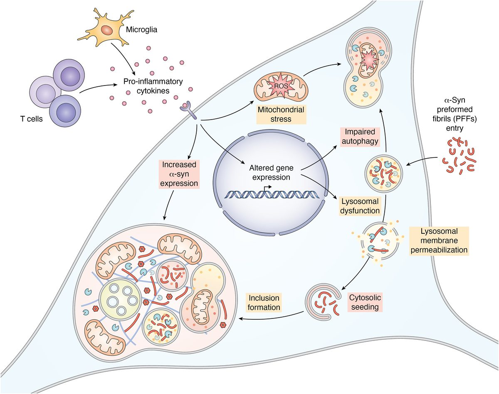
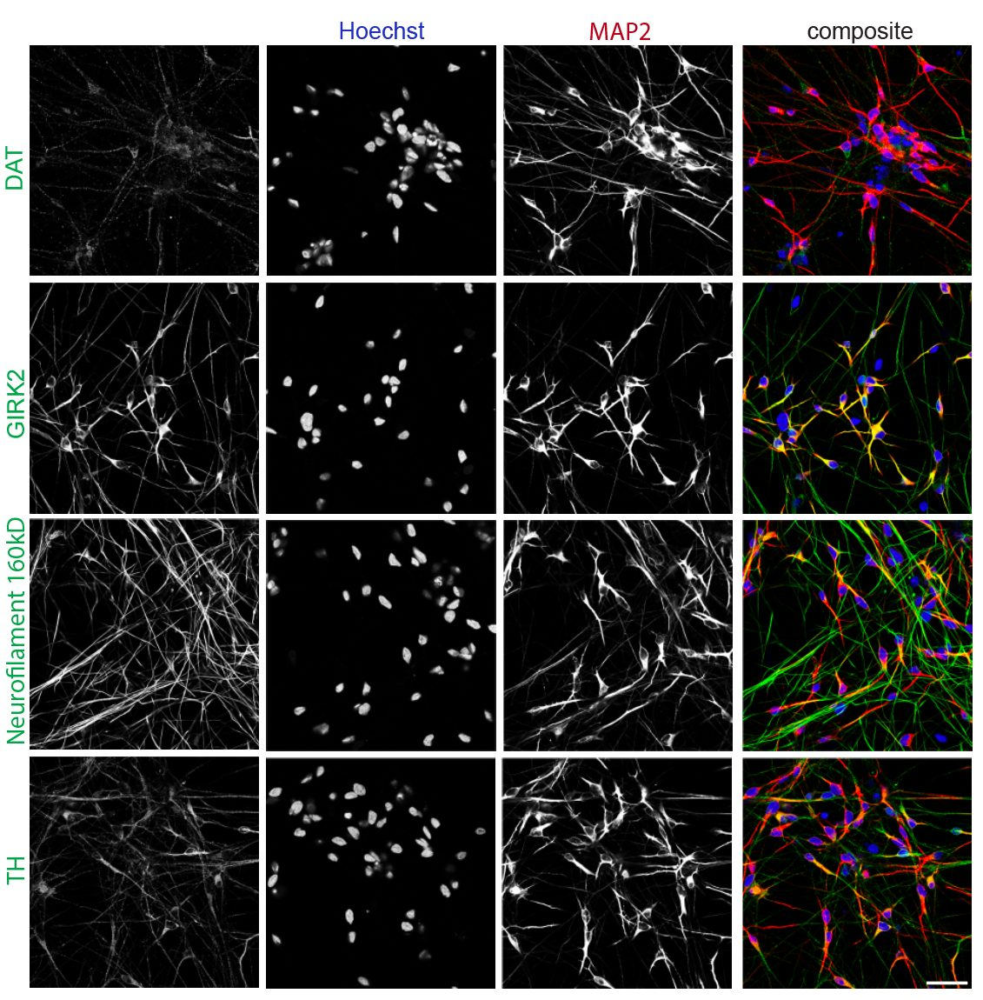
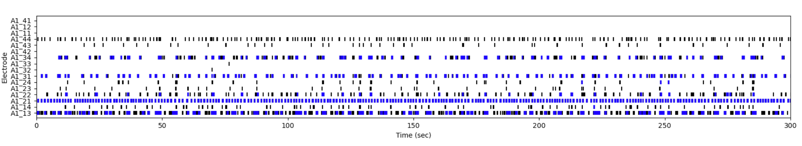
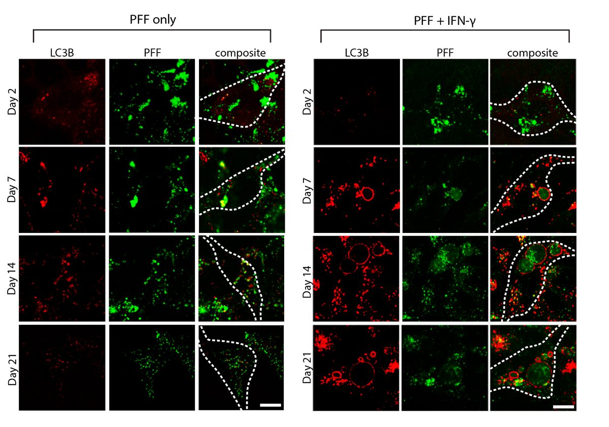
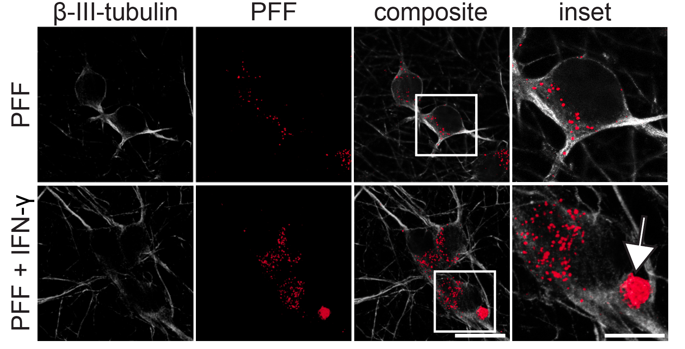
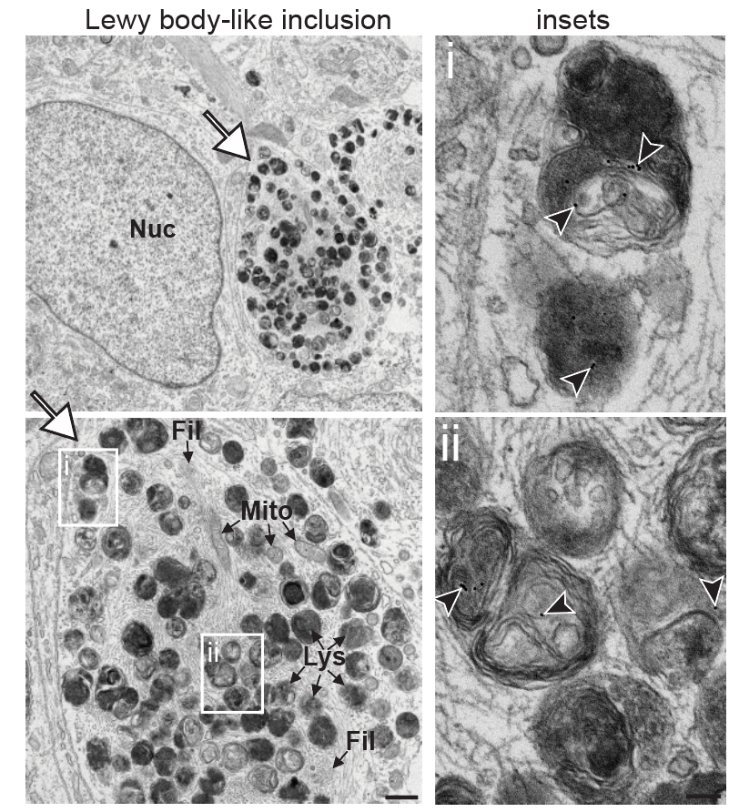
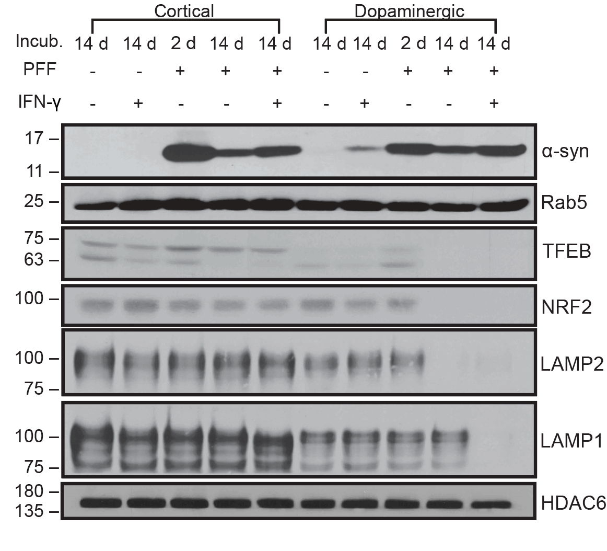
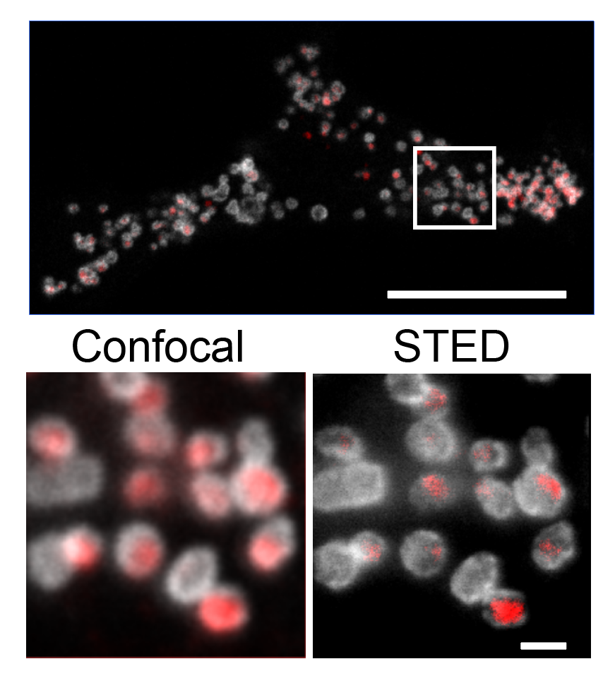
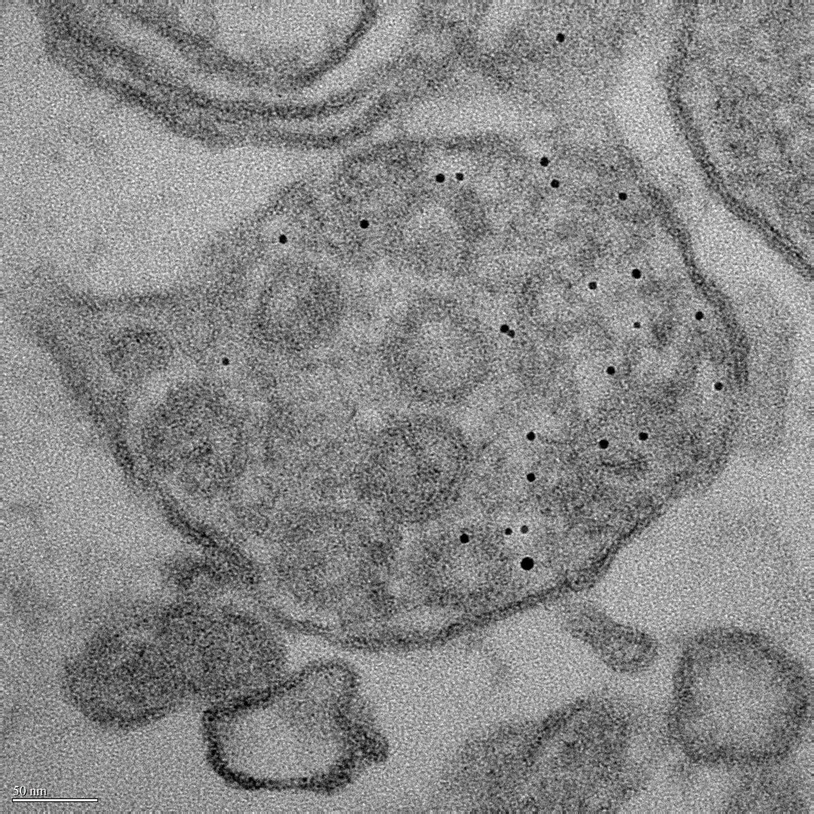

# Figcaption Examples

## Standalone Full-Width Images

### Schematic Diagrams
```html
<figure style="margin:0;">
  
  <figcaption>Schematic of the dual-hit Parkinson's disease model: microglia activation, cytokine release, α-synuclein PFF uptake via macropinocytosis, lysosomal dysfunction, and formation of membrane-bound Lewy body–like inclusions.</figcaption>
</figure>
```

### Immunofluorescence Panels
```html
<figure style="margin:0;">
  
  <figcaption>Immunocytochemistry panel confirming dopaminergic identity via DAT, GIRK2, Neurofilament 160kD, and TH with DAPI, MAP2, and composite overlays. From Bayati et al., Nature Neuroscience 2024.</figcaption>
</figure>
```

### Electrophysiology Data
```html
<figure style="margin:0;">
  
  <figcaption>Microelectrode array (MEA) raster plot showing spontaneous spike waveforms across dopaminergic and cortical neurons at DIV 42.</figcaption>
</figure>
```

### Time-Course Assay Data
```html
<figure style="margin:0;">
  
  <figcaption>Confocal time-course (Day 2–21) of LC3B puncta (autophagy marker) showing progressive impairment under PFF + IFN-γ dual-hit vs PFF-only control.</figcaption>
</figure>
```

## Gallery Thumbnail Images

### Confocal Microscopy
```html
<div class="gallery-thumb" data-caption="...">
  <div style="font-size:11px; color:var(--mid); padding:4px 6px; line-height:1.3; font-style:italic;">
    Confocal microscopy comparison of PFF-only (small puncta) vs dual-hit PFF + IFN-γ treatment (large perinuclear inclusions) in dopaminergic neurons.
  </div>
  
</div>
```

### Electron Microscopy
```html
<div class="gallery-thumb" data-caption="...">
  <div style="font-size:11px; color:var(--mid); padding:4px 6px; line-height:1.3; font-style:italic;">
    Electron microscopy of Lewy body–like inclusions at low (5 µm) and high (500 nm) magnification, showing fibrillar architecture, lysosomes, and mitochondria.
  </div>
  
</div>
```

### Western Blots
```html
<div class="gallery-thumb" data-caption="...">
  <div style="font-size:11px; color:var(--mid); padding:4px 6px; line-height:1.3; font-style:italic;">
    Western blots quantifying LAMP1, LAMP2, TFEB, and NRF2 protein levels in wild-type vs dual-hit neurons, showing IFN-γ–induced downregulation.
  </div>
  
</div>
```

### Super-Resolution Microscopy
```html
<div class="gallery-thumb" data-caption="...">
  <div style="font-size:11px; color:var(--mid); padding:4px 6px; line-height:1.3; font-style:italic;">
    STED super-resolution microscopy resolving sub-lysosomal architecture and fibril organization within 100 nm, revealing internal filamentous structure.
  </div>
  
</div>
```

### High-Magnification Nanogold Imaging
```html
<div class="gallery-thumb" data-caption="...">
  <div style="font-size:11px; color:var(--mid); padding:4px 6px; line-height:1.3; font-style:italic;">
    TEM at 98,000× magnification with 10 nm nanogold labeling revealing individual α-synuclein fibrils and their organization in cross-sectional profiles.
  </div>
  
</div>
```

## Caption Structure & Tone

### Key Characteristics
1. **Conciseness**: 1-2 sentences maximum
2. **Scientific accuracy**: Uses proper terminology and units
3. **Method-focused**: Describes what technique was used
4. **Finding-focused**: Explains what the image shows experimentally
5. **Context-aware**: References relevant publications or experimental conditions
6. **Visual description**: References colors, channels, or magnification when relevant

### Caption Templates by Image Type

**Microscopy (Confocal/Widefield)**
- Format: "[Marker/Channel names] showing [biological observation] at [time point/condition]"
- Example: "Confocal image of a dopaminergic neuron showing TH (red), nanogold-labeled PFF (green), and phospho-α-synuclein–enriched perinuclear inclusion after 14-day IFN-γ treatment."

**Electron Microscopy**
- Format: "[Tissue/compartment] at [magnification] showing [ultrastructural features]"
- Example: "Electron microscopy of Lewy body–like inclusions at low (5 µm) and high (500 nm) magnification, showing fibrillar architecture, lysosomes, and mitochondria."

**Biochemistry (Western Blots, HPLC)**
- Format: "[Proteins/molecules] across [conditions/timepoints], showing [quantitative finding]"
- Example: "Western blot quantification of α-synuclein and phospho-α-synuclein levels in cell lysates ± PAH treatment, demonstrating dose-dependent inclusion reduction."

**Functional Assays (MEA, Calcium Imaging)**
- Format: "[Measurement type] of [cell type/system] showing [activity pattern or response]"
- Example: "Microelectrode array (MEA) raster plot showing spontaneous spike waveforms across dopaminergic and cortical neurons at DIV 42."

**Cell Biology/Co-culture**
- Format: "[Cell type(s)] showing [morphology/phenotype change] in [condition]"
- Example: "Neuron–microglia co-culture showing accelerated α-synuclein inclusion formation and synaptic loss due to activated microglia-derived proinflammatory cytokines."

